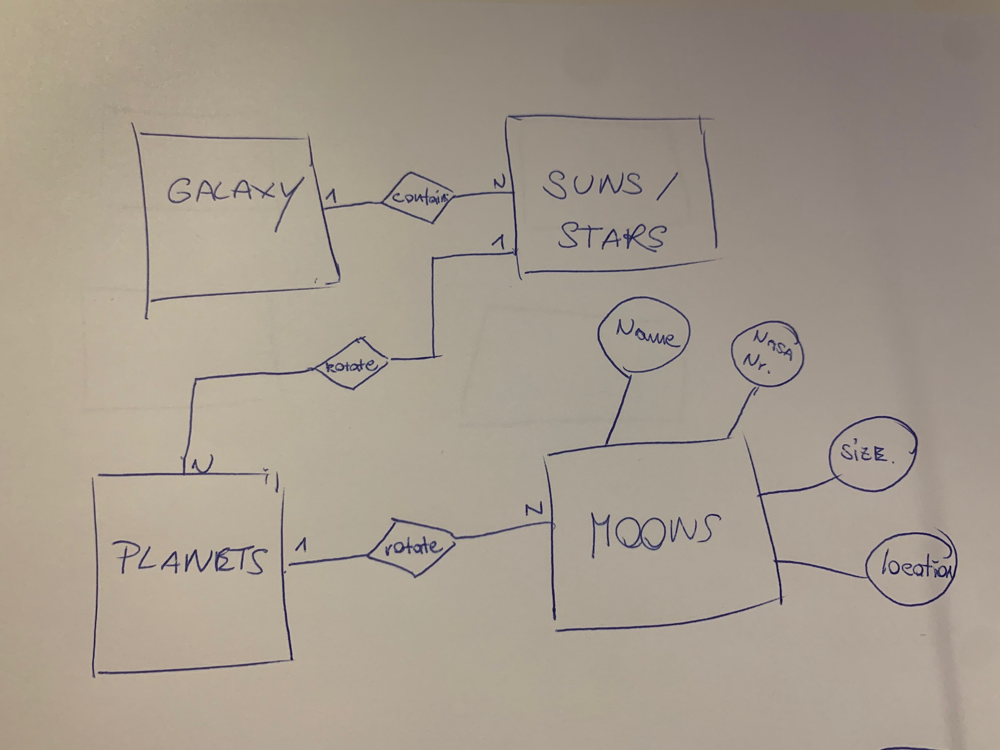
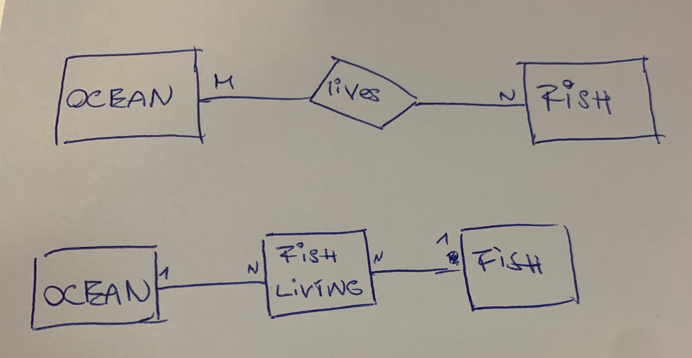
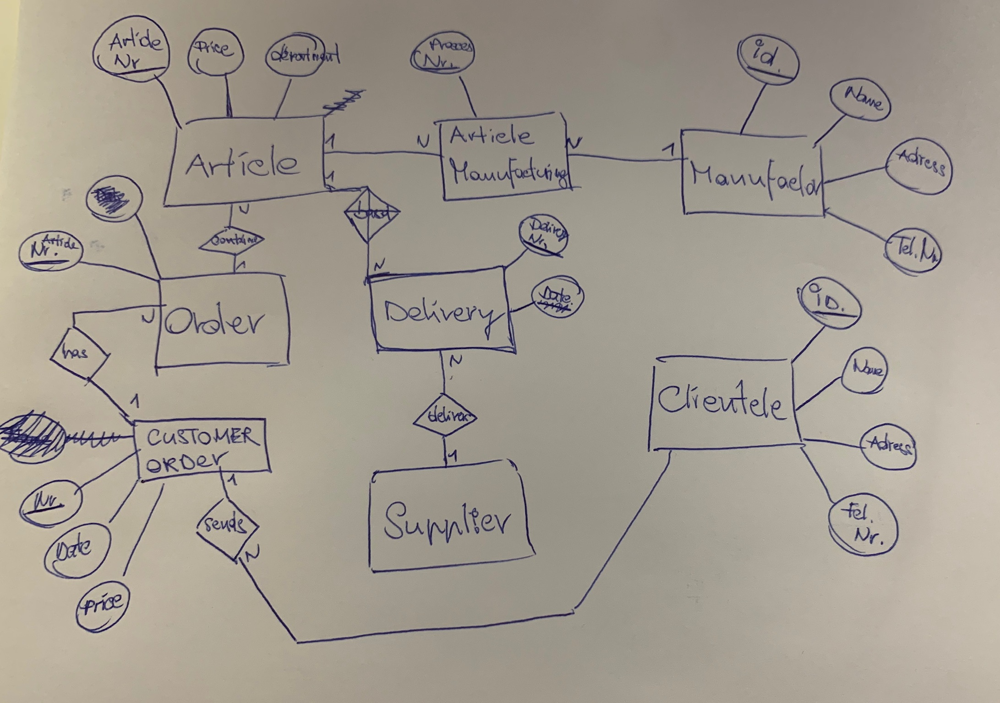
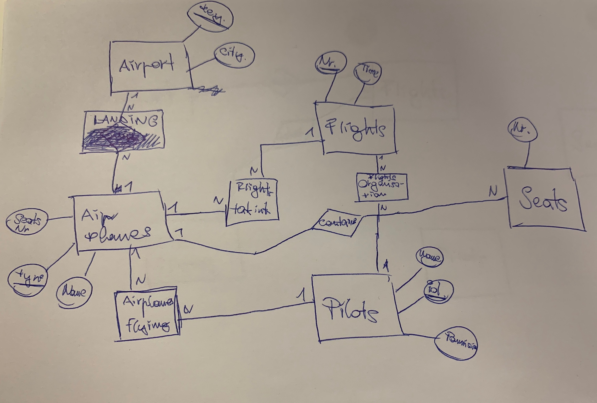

# DB-Test
## Aufgabe 1
Stelle Entitäten mittels Chen-Notation und Min,Max Notation dar.
Wähle ein sinnvolles Beispiel!

Chen

Min,Max

Chen

Min,Max

Chen

Min,Max

## Aufgabe 2
Kann eine Beziehung Attribute haben?

Ja

Wenn ja, wie stelle ich es im ERD dar?

Mit Kreisen die was vom Entität weg gehen

## Aufgabe 3
Welche Codd'schen Anforderungen gibt es (Nenne mindestens 5)

1. Synchrosination 
2. Integration
3. Transaktion
4. Operation
5. Datensicherung

## Aufgabe 4
Nenne den Unterschied zwischen Konzeptuellen und Logischem Schema

In dem Konzeptuellen Schema macht man zuerst den groben Überblick über die Datenbank welche Entitäten welche Tabelle es geben wird welche Beziehungen zwischen die Tabellen es gibt was sind die Schlüssel und die Attribute usw.

Und in der Logischem Schema macht man dann die richtigen Tabellen und man schaut das alles schnell erreichbar ist und logisch aufgebaut ist.

Man fangt immer mit der Konzeptuellen Schema an bevor man die Logische Schema macht. 

## Aufgabe 5
Welche 3 Bestandteile gibt es im Entity Relationship Model?

* Bestandteil Nr.1 = Entität
* Bestandteil Nr.2 = Beziehung
* Bestandteil Nr.3 = Eigenschaft

## Aufgabe 6
Welche Datentypen gibt es in MySQL? (Nenne mindestens 5)

1. VARCHAR
2. INTEGER
3. CHAR
4. DOUBLE
5. DATE

## Aufgabe 7
Welche Arten von Schlüsseln gibt es und welche Eigenschaften besitzen diese?

* Primärschlüssel
* Sekundärschlüssel
* Fremdschlüssel

## Aufgabe 8
Welche Arten von Beziehungen gibt es? Zeichne für jede ein Beispiel auf?

Beziehungen zwischen zwei Entitäten

Beziehungen zwischen mehrere Entitäten

Beziehungen mit sich selber

## Aufgabe 9
Was bedeutet der Begriff Kardinalität und welche Kardinalitäten gibt es?

Kardinalität ist das Verhältniss von der Beziehung zwischen die Entitäten zum Beispiel:

* 1 zu 1 (eine Entität hat eine Beziehung zu eine Entität)
* 1 zu N (eine Entität hat eine Beziehung zu mehreren Entitäten)
* M zu N (mehreren Entitäten haben eine Beziehung zu mehreren Entitäten) 

## Aufgabe 10
Was bedeutet der Begriff Datenintegrität und worin unterscheidet sich Integrität und referentielle Integrität?

Mit Datenintegrität ist gemeint wie sicher die Daten sind wie korrekt die Daten sind und ob sie veränderbar sind oder nicht. Die Korrektheit der Daten ist in der Datenintegrität sehr wichtig.

Die referentielle Integrität das Eigenschaften von einem Fremdschlüssel auch auf einen Primärschlüsse übertragen werden können.

## Aufgabe 11
Erkläre die 3 Normalformen

Die 1NF ist das zusammengeschachtelte oder zusammengesetzte Eigenschaften nicht erlaubt sind. Zbsp: Für die Adresse muss selber eine Tabelle gemacht werden damit sie als Eigenschaft verwendet werden kann.

Die 2NF ist das jede Eigenschaft das nicht Teil des Primärschlüssels ist, ist von den anderen Abhängig und darum muss immer eine extra Tabelle gemacht werden.

Die 3NF ist wenn eine Nichtschlüsseleigenschaft immer von ein Primärschlüssel abhängig.

## Aufgabe 12
Erkläre den Unterschied zwischen starken und Schwachen Entitäten und erstelle ein Beispiel.

In eine Datenbank ist eine schwache Entität wenn sie nicht alleine durch die Eigenschaften identifiziert werden kann. Deshalb muss immer ein Fremdschlüssel verwendet werden, um gemeinsam mit den restlichen Eigenschaften einen Primärschlüssel zu machen. Der Fremdschlüssel kommt von der starken Entität und die schwache Entität ist abhängig und kann nicht ohne der starken Entität existieren.

## Aufgabe 13
Welche Grundregeln gibt es im Relationenmodell? (Nenne mindestens 4)

## Aufgabe 14
Wie löst man eine M:N Beziehung auf? Erstelle ein Beispiel

## Aufgabe 15
Ein Handelsbetrieb verkauft ein Sortiment von Artikeln, die er von verschiedenen Herstellern bezieht. Der Handelsbetrieb hat einen bestimmten Kundenkreis, der regelmäßig Bestellungen aufgibt. Eine Bestellung kann mehrere Artikel umfassen. Ein Artikel kann von mehreren Lieferanten bezogen werden und ein Lieferant liefert natürlich meist mehr als einen Artikel. Erstelle ein ERD und ein Relationenmodell, welches der 3. Normalform entspricht.

Article (article Nr. : INTEGER, price: DOUBLE, department: VARCHAR) 
Article Manufacturing (procces Nr. INTEGER) 
Manufactor (ID: INTEGER, name: VARCHAR, adress: VARCHAR, tel.Nr. : INTEGER) 
Clientele (ID: INTEGER, name: VARCHAR, adress: VARCHAR, tel.Nr. : INTEGER) 
Delivery (delivery Nr. INTEGER, date: DATE) 
Custom Order (Nr.: INTEGER, date: DATE, price: DOUBLE) 
Order (article Nr.: INTEGER) 

## Aufgabe 16
Welche Anomalien kennst du und was beschreiben sie?

* Änderungsanomalien: 
Wenn eine Entität geändert wird von eine Tabelle und sie nicht richtig gespeichert war gehen alle anderen Enitäten auch verloren

* Löschanomalien: 
Wenn eine Entität gelöscht wird muss auch der Platz in der Tabelle gelöscht werden sonst haben die anderen Entitäten alle die falschen Eigenschaften.

## Aufgabe 17
Modellieren Sie den angeführten Realitätsausschnitt einer Fluggesellschaft mit Hilfe eines Entity Relationship- Diagramms. Treffen Sie, falls notwendig, sinnvolle Annahmen und dokumentieren Sie diese nachvollziehbar in Ihrer Lösung. Der zu betrachtende Realitätsausschnitt der Fluggesellschaft umfasst folgenden
Sachverhalt:
Flughäfen haben ein Kürzel (= Schlüssel) und gehören zu einer Stadt (z.B. „FRA“ für Frankfurt, „FCO“ für Roma Fiumicino).
Flüge haben eine Flugnummer (z.B. „LH 306“), führen von einem Flughafen zu einem anderen, mit jeweils einer festen Abflugs- und Ankunftszeit (z.B. ab Frankfurt um 07:30 nach Roma Fiumicino mit Ankunft um 09:15).
Jeder Flugzeugtyp hat einen Namen (z.B. „747-400“) und eine Sitzanzahl (z.B. 430 Sitze).
Piloten haben einen Namen (z.B. „Meier“), ein Geburtsdatum (z.B. „1.1.1960“) und eine Berechtigung, bestimmte Flugzeugtypen zu fliegen (z.B. „747-400“ und „A310“).
Jedes einzelne Flugzeug ist von einem bestimmten Flugzeugtyp (z.B. „747-400“) und hat einen Namen (z.B. „Mozart“).
Bei einem Flug-Einsatz wird ein Flug (z.B. „LH 306“) an einem bestimmten Datum (z.B. „6.2.2011“) von einem bestimmten Piloten (z.B. „Meier“) mit einem bestimmten Flugzeug (z.B. „Mozart“) geflogen.
Bilden Sie das konzeptuelle Schema in ein relationales Schema ab. Das relationale Schema soll der 3. Normalform genügen.

Airport (key: INTEGER, city: VARCHAR) 
Flights (Nr.: INTEGER, time: DATE) 
Seats (Nr. INTEGER) 
Pilots (name: VARCHAR, ID: INTEGER, permission: INTEGER, birthday: DATE) 
Airplanes (type: INTEGER, name: VARCHAR, seats number: INTEGER) 
Seats (nr.: INTEGER)

